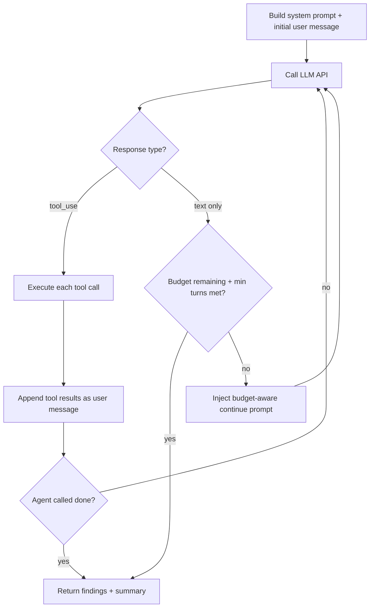

pwnkit runs security assessments by putting an LLM in a loop with tools. There is no hard-coded playbook. The agent receives a system prompt describing the target and available tools, reasons about what to try, executes tools, reads the results, and decides what to do next. This page explains the loop in detail.

## Loop overview

The core loop lives in `packages/core/src/agent/native-loop.ts` (`runNativeAgentLoop`). It uses Claude's native Messages API with structured `tool_use` blocks rather than parsing text output. Here is the simplified flow:



Each iteration of this loop is one **turn**. The agent has a configurable turn budget (`maxTurns`), typically 15-100 depending on scan depth and mode. The loop exits when the agent calls the `done` tool, produces a text-only response after enough turns, or exhausts its budget.

## What the agent sees

### System prompt

The system prompt is the single most important input. It tells the agent what it is, what tools it has, and how to approach the target. pwnkit assembles different prompts depending on the scan mode:

- **`shellPentestPrompt`** (web targets) -- A concise prompt that gives the agent `bash`, `save_finding`, and `done`. It tells the agent to use curl, python3, and standard CLI tools to probe the target, find auth, test injection points, and extract flags. No structured HTTP tools -- just a shell.
- **`discoveryPrompt`** / **`attackPrompt`** (LLM/AI targets) -- Role-specific prompts for probing AI endpoints, extracting system prompts, and testing jailbreaks.
- **`researchPrompt`** (source code) -- Instructs the agent to map a codebase, trace data flow from inputs to dangerous sinks, and write proof-of-concept exploits.

The prompt includes concrete target details: the URL, any known endpoints, detected features, and (for attack agents) results from the discovery phase.

### Tool results

After each tool call, the result is appended to the conversation as a `tool_result` message. The agent sees the full stdout/stderr from bash commands, HTTP response bodies, or structured output from tools like `save_finding`. This gives it ground truth to reason about -- actual server responses, not hypothetical ones.

### Budget-aware reflection prompts

When the agent responds with text but no tool calls (meaning it is "thinking out loud" instead of acting), the loop injects a continue prompt that varies based on how much budget remains:

| Budget used | Prompt tone |
|---|---|
| < 30% | "Use your tools. Start by sending requests to the target." |
| 30-50% | "Summarize what you have learned. What is your top hypothesis?" |
| 50-70% | "HALFWAY. List every approach tried. What is the most promising untested vector?" |
| 70-85% | "URGENCY. If current approach is not working, SWITCH NOW." |
| 85-100% | "FINAL PUSH. Go for the highest-confidence exploit path ONLY." |

These checkpoints prevent the agent from spending all its turns on a single dead-end approach. They are inspired by budget-aware scheduling from the Cyber-AutoAgent paper.

## Tool execution

The `ToolExecutor` class in `packages/core/src/agent/tools.ts` handles all tool calls. The three tools that matter most for web pentesting:

### `bash`

Runs an arbitrary shell command and returns stdout and stderr. The agent uses this for everything: `curl` requests, Python exploit scripts, `jq` parsing, file enumeration. The `TARGET` environment variable is set to the target URL. Commands have a configurable timeout (default 30 seconds, max 120).

### `save_finding`

Persists a vulnerability finding to the database. Takes a title, severity, category, and evidence (the request that triggered it, the response proving it, and analysis). Findings are stored in SQLite and survive across scan stages -- the verification agent can later confirm or reject them.

### `done`

Signals that the agent has finished its task. Takes a summary string. When the loop sees a successful `done` call, it sets `state.done = true` and exits.

Other tools exist for specific modes: `http_request` and `submit_form` for structured HTTP, `send_prompt` for LLM targets, `read_file` and `run_command` for source analysis, `crawl` for web spidering, and `browser` for Playwright-driven headless browser automation. The `spawn_agent` tool lets the agent create a sub-agent with fresh context for deep exploitation of a specific vulnerability.

## How it decides what to do

The agent is an LLM. It reads the system prompt, sees the target, and reasons about what to try. There are no decision trees or hard-coded attack sequences. The system prompt provides a framework ("recon first, then auth, then attack each input"), but the agent decides:

- Which endpoints to probe first
- Whether a response indicates a vulnerability worth pursuing
- When to switch from one attack class to another
- How to chain findings (login -> escalate -> extract)
- When to write a multi-step Python script vs. use simple curl commands

This is why the shell-first approach works well: bash gives the agent maximum flexibility to compose tools, write scripts, and chain commands in ways that no finite set of structured tools can anticipate.

## Walk-through: IDOR exploitation

Here is an annotated example of what a typical web pentest session looks like. The agent is targeting a vulnerable web app at `http://target:8080`.

**Turn 1 -- Reconnaissance.** The agent calls `bash` with `curl -i http://target:8080/`. It reads the response: an HTML page with a login form, a nav bar linking to `/dashboard` and `/profile`, and a footer mentioning "Demo credentials: demo / demo".

**Turn 2 -- Authentication.** The agent spots the credentials in the response text. It runs `curl -c /tmp/jar -b /tmp/jar -d 'username=demo&password=demo' -L http://target:8080/login`. The response is a 302 redirect to `/dashboard` with a `Set-Cookie` header. The agent now has a session.

**Turn 3 -- Authenticated enumeration.** With the session cookie, the agent curls `/dashboard` and `/profile`. The profile page loads `/api/users/1` and shows the current user's data, including `"id": 1, "username": "demo", "email": "demo@example.com"`.

**Turn 4 -- IDOR probe.** The agent changes the ID: `curl -b /tmp/jar http://target:8080/api/users/2`. The response returns a different user's data: `"id": 2, "username": "admin", "email": "admin@corp.com", "flag": "FLAG{idor_1a2b3c}"`.

**Turn 5 -- Save and finish.** The agent calls `save_finding` with the IDOR evidence (the request to `/api/users/2`, the response containing another user's data and the flag, and analysis explaining that the endpoint lacks authorization checks). Then it calls `done`.

The entire session took 5 turns. The agent recognized the credentials hint on the page, authenticated, found an ID-parameterized endpoint, tested access control by changing the ID, and extracted the flag. No playbook told it to do this in this order -- it reasoned through it.

## Debugging

### `--verbose` flag

Run pwnkit with `--verbose` to see the full agent conversation. This prints:

- The system prompt sent to the LLM
- Each tool call name and arguments
- Tool results (stdout/stderr from bash, HTTP responses)
- Budget-aware continuation prompts when they fire
- Token usage per turn and cumulative totals
- The final summary and finding count

### Interpreting agent output

Common patterns to watch for:

- **Agent loops on the same payload** -- The budget prompts should force a switch after 50-70% of turns. If it keeps repeating, the system prompt may need adjustment.
- **"API returned empty response"** -- Rate limiting or model unavailability. Check your API key and usage limits.
- **Agent exits too early** -- The loop requires at least 4 turns (or `maxTurns` if smaller) before allowing a text-only exit. If the agent is finishing in 2-3 turns, it is likely calling `done` prematurely.
- **No findings saved** -- The agent may be detecting vulnerabilities but not calling `save_finding`. Check verbose output for tool calls.

### Event log

Every tool call, error, and stage transition is logged to SQLite via `db.logEvent`. You can query the event log for a scan to reconstruct exactly what happened:

```bash
pwnkit history <scan-id> --events
```

Session state is persisted every 2 turns, so interrupted scans can be resumed with `--resume <scan-id>`.
